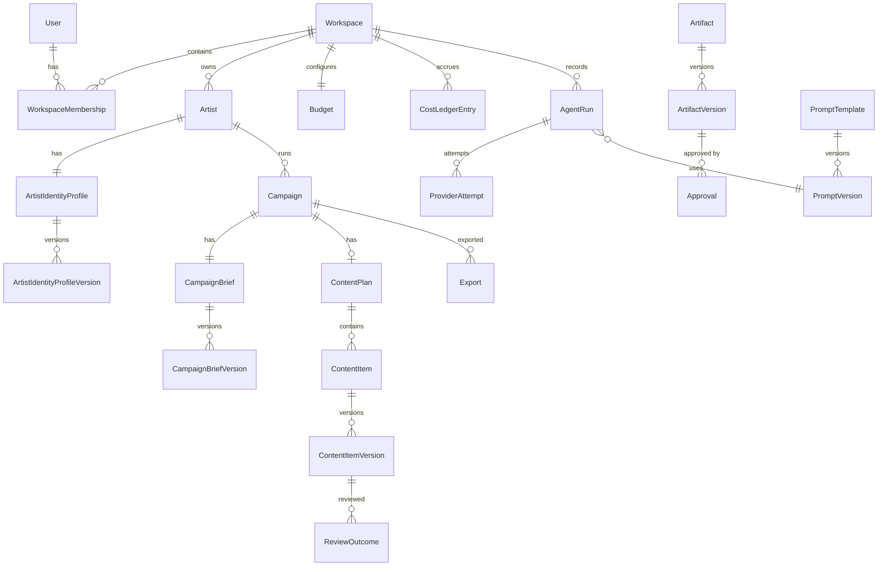
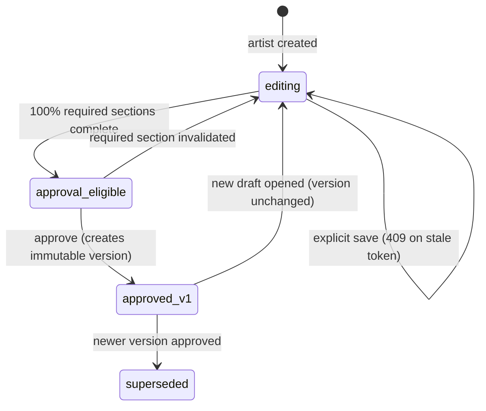
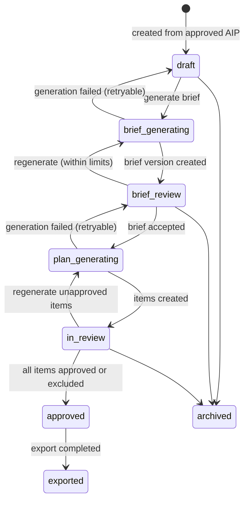
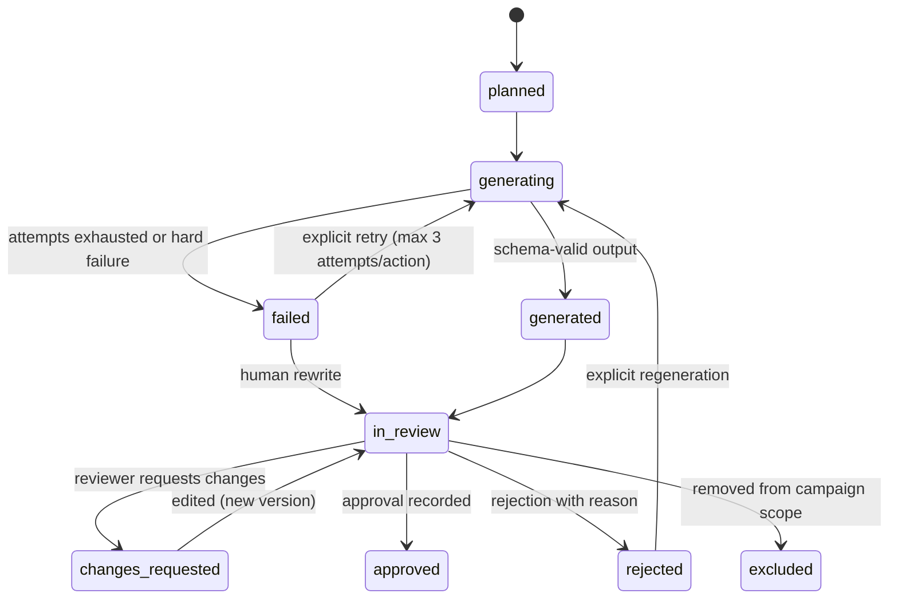
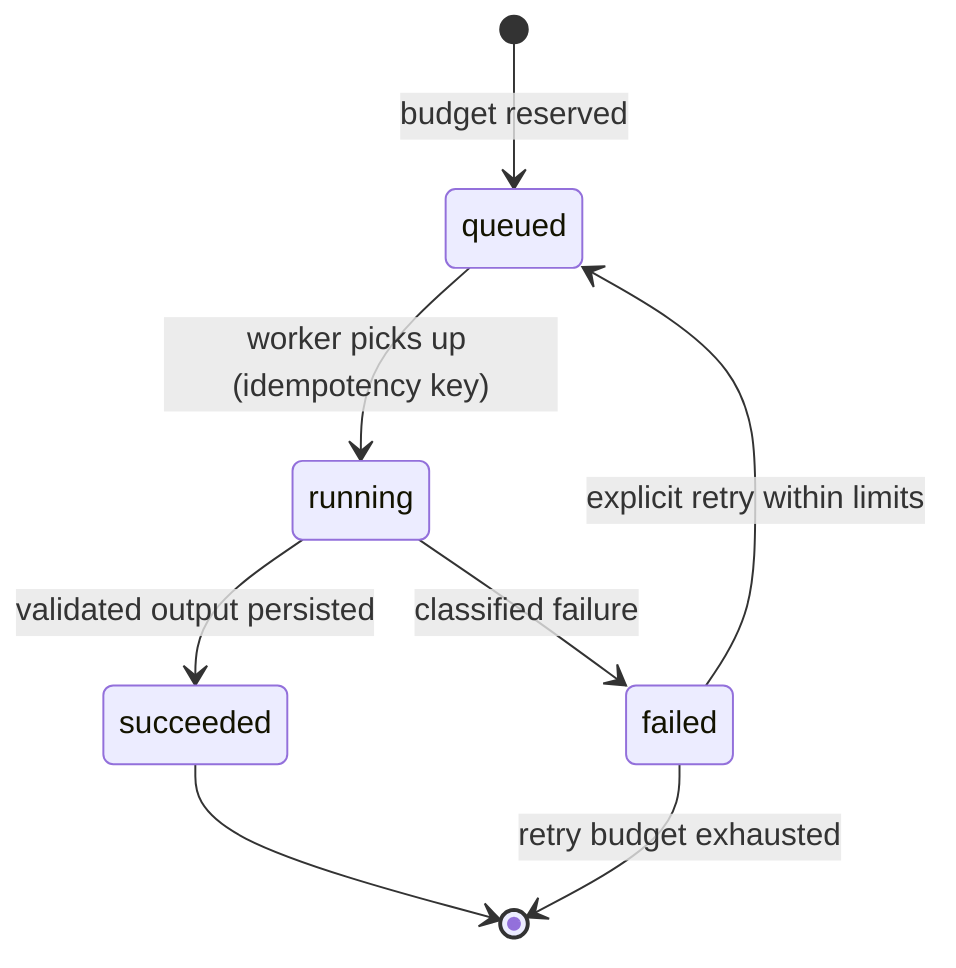
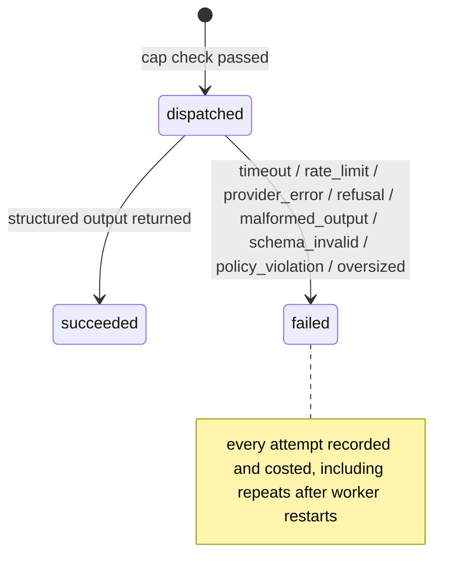

# Marketing Commander — Domain Model v1

- Status: draft (approval follows the MVP Product Brief; see
  [plan/plan.md](../../plan/plan.md))
- Owner: Nick Baynham
- Updated: 2026-07-18

This model is understandable independently of the database design. Storage
mapping (JSONB, tables, indexes) is defined in the
[Technical Design](../architecture/technical-design.md). Business rules
(BR-xxx) and decisions (DEC-xx) are defined in the
[MVP Product Brief](mvp-product-brief.md). Requirements (REQ-xxx) are defined
in [requirements.md](../../knowledge/requirements/requirements.md).

## Conventions

Unless an entity states otherwise:

- Identifier: UUIDv7, generated by the application, stable for the record's
  lifetime.
- Workspace ownership: every owned aggregate carries `workspace_id` (BR-001).
- Audit behavior: create, update, state-transition, approval, and deletion
  actions write an audit record with actor ID, action, entity reference, and
  timestamp (BR-020, REQ-040).
- Versioning: mutable working state lives on a draft record; approved state
  lives in immutable version records (BR-005, BR-006).
- Deletion: hard deletion is an aggregate-level operation requiring explicit
  confirmation naming what is lost (BR-015). Individual approved versions and
  approval records are never deleted selectively while their aggregate
  survives.
- Update rule: only non-approved states are editable (BR-003); stale writes
  are rejected under optimistic concurrency (BR-019).

## Key Domain Definitions

- Workspace: the ownership, authorization, budget, and data-isolation
  boundary containing users, artists, campaigns, artifacts, agent runs, and
  settings.
- Increment: the smallest reviewable unit within a phase that delivers
  demonstrable behavior, documentation, infrastructure, or validated design
  and has explicit acceptance criteria and tests.
- Approval: an immutable record of an authorized actor accepting a specific
  immutable version.
- Superseding: creating a new version that replaces the active authority of
  an older approved version without mutating the older record.
- Review outcome: a measurable per-review result with one of the values
  `approved_unedited`, `approved_minor_edit`, `approved_substantive_edit`,
  `regenerated`, `rejected`. Classification rules: `approved_substantive_edit`
  applies when the reviewer changes the hook, the caption's message, or the
  call to action's intent, or edits more than 30% of the item's characters;
  `approved_minor_edit` applies to smaller wording or formatting edits. The
  reviewer's explicit classification wins over the character heuristic when
  they disagree, and the chosen classification is recorded (DEC-05).

## High-Level Entity Relationships

## Entities

### User

- Purpose: a human identity performing actions; the MVP seeds exactly one
  (`local-owner`, DEC-03).
- Aggregate boundary: own aggregate root (not workspace-owned; users span
  workspaces).
- Identifier: stable user ID; the seeded owner uses `local-owner`.
- Workspace ownership: none (global); linked to workspaces via
  WorkspaceMembership.
- Required fields: user ID, display name, identity source (`local_seed` for
  MVP; authentication source added in Phase 8).
- Optional fields: email (Phase 8), authentication linkage.
- Relationships: 1—N WorkspaceMembership; referenced by Approval, AgentRun,
  ReviewOutcome, audit records.
- Invariants: identity source is recorded; the seeded owner ID never changes.
- Lifecycle states: `active`, `deactivated` (Phase 8).
- Allowed transitions: active → deactivated → active.
- Forbidden transitions: deletion while approval records reference the user.
- Creation: seeded at first run (MVP); registration in Phase 8.
- Update: display name editable; user ID immutable.
- Archival/deletion: deactivation only; approval provenance survives.
- Versioning: none. Audit: all identity changes audited.
- Requirements: REQ-002. Business rules: BR-020.

### Workspace

- Purpose: the ownership, authorization, budget, and data-isolation boundary
  (DEC-01).
- Aggregate boundary: aggregate root containing memberships and settings;
  other aggregates reference it by `workspace_id`.
- Identifier: workspace ID.
- Required fields: name, created-by actor.
- Optional fields: settings (provider configuration reference, defaults).
- Relationships: 1—N WorkspaceMembership, Artist, AgentRun, CostLedgerEntry;
  1—1 Budget.
- Invariants: exactly one workspace exists in the MVP; deleting a workspace
  deletes everything it owns (BR-015 confirmation names this).
- Lifecycle states: `active`, `archived` (post-MVP).
- Creation: first-run setup (golden path Step 1); idempotent — a second
  creation attempt returns the existing workspace.
- Update: name and settings editable by owner.
- Versioning: none. Audit: creation and settings changes audited.
- Requirements: REQ-001. Business rules: BR-001.

### WorkspaceMembership

- Purpose: links a user to a workspace with a role.
- Aggregate boundary: part of the Workspace aggregate.
- Identifier: membership ID; unique per (user, workspace).
- Required fields: user ID, workspace ID, role (`owner`, `admin`, `editor`,
  `reviewer`, `viewer`), granted-by, granted-at.
- Relationships: N—1 User, N—1 Workspace.
- Invariants: at least one owner per workspace; the MVP has exactly one
  membership (`local-owner` as `owner`).
- Lifecycle states: `active`, `revoked` (Phase 8).
- Forbidden transitions: revoking the last owner.
- Creation: seeded with the workspace (MVP); invitation flow in Phase 8.
- Versioning: none. Audit: grants and revocations audited.
- Requirements: REQ-002. Business rules: BR-001, BR-020.

### Artist

- Purpose: the marketed artist (CYR3NT first); anchor of the three journeys.
- Aggregate boundary: aggregate root; AIP and campaigns reference it.
- Identifier: artist ID.
- Workspace ownership: `workspace_id` required; an artist belongs to exactly
  one workspace and may not move between workspaces in the MVP (DEC-01).
- Required fields: name, lifecycle state.
- Optional fields: genre descriptor, short summary, links.
- Relationships: 1—1 ArtistIdentityProfile; 1—N Campaign.
- Invariants: name unique within workspace.
- Lifecycle states: `active`, `archived`.
- Allowed transitions: active → archived → active (reversible, BR-014).
- Forbidden transitions: none besides deletion constraints.
- Creation: golden path Step 2; creates the empty AIP draft with it.
- Update: profile fields editable in `active`; archived artists are
  read-only and block new campaigns and generation (BR-014).
- Deletion: removes the artist aggregate (AIP, campaigns, content, local
  generation data) after explicit confirmation (BR-015, DEC-10 deletion
  right).
- Versioning: none (identity content versions live on the AIP).
- Requirements: REQ-003, REQ-004, REQ-005. Business rules: BR-001, BR-014,
  BR-015.

### ArtistIdentityProfile (AIP)

- Purpose: the working draft of the artist's identity: sections, statuses,
  metadata, completeness.
- Aggregate boundary: part of the Artist aggregate; root of its own version
  records.
- Identifier: AIP ID (one per artist).
- Required fields: artist ID, workspace ID, section set per DEC-02 (each
  section: content fields, status `empty` | `draft` | `ready_for_review` |
  `approved`, confidence metadata, source metadata), draft version token.
- Optional fields: optional sections (origin and motivation, influence map,
  unknowns and assumptions) with explicit `unknown` state support.
- Relationships: 1—N ArtistIdentityProfileVersion.
- Invariants: completeness and approval eligibility are derived per DEC-02,
  never stored as free-standing editable values; placeholder text never
  counts as complete.
- Lifecycle states (draft): `editing`, `approval_eligible` (derived).
- Creation: with the artist. Update: explicit save under optimistic
  concurrency (BR-019); HTTP 409 on stale token.
- Versioning: approval snapshots the draft into an immutable version.
- Audit: every save and status change audited.
- Requirements: REQ-006–REQ-011, REQ-017. Business rules: BR-002, BR-003,
  BR-019.

### ArtistIdentityProfileVersion

- Purpose: an immutable snapshot of the AIP at approval (v1.0 is the first).
- Aggregate boundary: owned by the AIP.
- Identifier: version ID plus monotonically increasing version number.
- Required fields: AIP ID, workspace ID, version number, full section
  snapshot, created-from draft token, created-at.
- Relationships: N—1 AIP; 1—N Approval (exactly one approval in MVP);
  referenced by Campaign (`approved_aip_version_id`).
- Invariants: immutable after creation (BR-005); superseding creates a new
  version (BR-006); active authority belongs to the latest approved version.
- Lifecycle states: `approved`, `superseded`.
- Allowed transitions: approved → superseded (by a newer approval).
- Forbidden transitions: any content mutation; deletion while referenced.
- Creation: only through the approval workflow on an eligible draft (BR-004).
- Versioning: is the version record. Audit: creation and superseding audited.
- Requirements: REQ-013, REQ-014, REQ-015. Business rules: BR-004–BR-006.

### Artifact

- Purpose: generalization of versionable, approvable records (AIP, campaign
  brief, content plan, content item, export bundle) so approval, version
  history, and rendering behave uniformly.
- Aggregate boundary: abstraction realized by the concrete aggregates; the
  version-history UI (SCR-24) and export metadata operate on this shape.
- Identifier: artifact ID with artifact type.
- Required fields: type, owning entity reference, workspace ID.
- Relationships: 1—N ArtifactVersion.
- Invariants: exactly one active-authority version at a time.
- Lifecycle, creation, update, deletion: delegated to the concrete entity.
- Requirements: REQ-014, REQ-015. Business rules: BR-005, BR-006.

### ArtifactVersion

- Purpose: the immutable unit of approval and export across artifact types.
- Identifier: version ID plus version number within the artifact.
- Required fields: artifact ID, version number, content snapshot, creator
  (human actor or agent run), created-at, state.
- Relationships: N—1 Artifact; 0—N Approval; referenced by Export.
- Invariants: immutable once approved; approval references one exact version.
- Lifecycle states: `draft`, `approved`, `superseded`, `rejected`.
- Allowed transitions: draft → approved | rejected; approved → superseded.
- Forbidden transitions: approved → draft; any mutation of approved content.
- Requirements: REQ-013–REQ-016. Business rules: BR-004–BR-006, BR-020.

### Approval

- Purpose: an immutable record of an authorized actor accepting a specific
  immutable version.
- Aggregate boundary: owned by the approved version's aggregate.
- Identifier: approval ID.
- Required fields: version reference (exact version ID), actor ID (never
  null, BR-020), timestamp, approval context (individual or bulk, with bulk
  batch reference).
- Optional fields: shared review note (DEC-08).
- Invariants: immutable; never rewritten by later identity migration
  (DEC-03); one approval per (version, actor) per action.
- Creation: only through the approval workflows (BR-004, BR-010).
- Deletion: never, while the aggregate survives (BR-015).
- Requirements: REQ-016, REQ-026. Business rules: BR-004, BR-010, BR-020.

### Campaign

- Purpose: a bounded marketing effort for an artist over a timeframe
  (DEC-04).
- Aggregate boundary: aggregate root containing brief, plan, items, exports.
- Identifier: campaign ID.
- Required fields (DEC-04): workspace ID, artist ID, approved AIP version
  ID, name, objective, summary, start date, end date, target audience,
  platforms, posting cadence, constraints, status, version.
- Optional fields: available assets, content pillars and weekly themes
  (populated from the accepted brief), generation metadata.
- Relationships: N—1 Artist; 1—1 CampaignBrief; 1—0..1 ContentPlan; 1—N
  Export; referenced by AgentRun and CostLedgerEntry.
- Invariants: bound to one exact approved AIP version (BR-007); approval
  requires all items approved or excluded (BR-004).
- Lifecycle states: `draft`, `brief_generating`, `brief_review`,
  `plan_generating`, `in_review`, `approved`, `exported`, `archived`.
- Allowed transitions: draft → brief_generating → brief_review →
  plan_generating → in_review → approved → exported; any pre-approved state
  → archived; brief_review → brief_generating (regeneration); in_review →
  plan_generating (regeneration of unapproved items).
- Forbidden transitions: approved → any editing state (superseding versions
  only); exported → draft.
- Creation: golden path Step 7 (requires approved AIP).
- Update: editable in `draft` and review states per BR-003.
- Archival/deletion: archival reversible; deletion removes the campaign
  aggregate with confirmation (BR-015).
- Versioning: campaign-level version increments on approved change;
  brief and items version separately (DEC-04).
- Requirements: REQ-018, REQ-027. Business rules: BR-003, BR-004, BR-007.

### CampaignBrief / CampaignBriefVersion

- Purpose: the strategic brief for a campaign; versions are generated or
  human-edited proposals until accepted.
- Identifier: brief ID; version ID with version number.
- Required fields (version): brief ID, content (objective framing, audience,
  pillars, weekly themes, cadence rationale), creator (agent run or human),
  generation metadata, state.
- Relationships: brief N—1 Campaign; version N—1 brief; version 0—N
  ReviewOutcome.
- Invariants: versioned independently of content items (DEC-04); accepted
  version feeds plan generation; approved versions immutable.
- Lifecycle (version): `generated` | `edited` → `accepted` | `rejected` |
  `superseded`.
- Creation: generation (Step 8) or manual editing.
- Requirements: REQ-019, REQ-020. Business rules: BR-005, BR-006, BR-008,
  BR-016.

### ContentPlan

- Purpose: the 30-day calendar window container for content items.
- Identifier: plan ID.
- Required fields: campaign ID, workspace ID, window start and end dates,
  cadence snapshot, generation metadata.
- Relationships: 1—N ContentItem; N—1 Campaign.
- Invariants: window covers 30 calendar days; item count derives from
  cadence, not a fixed 30 (DEC-04).
- Lifecycle states: `generating`, `in_review`, `complete` (all items
  resolved).
- Creation: plan generation (Step 10). Regeneration replaces only unapproved
  items (BR-012 scope, DEC-04).
- Requirements: REQ-021. Business rules: BR-008.

### ContentItem / ContentItemVersion

- Purpose: one planned piece of content; versions carry the actual content
  so approved content is never overwritten.
- Identifier: stable item ID; version ID with per-item version number.
- Required fields (item): campaign ID, plan ID, sequence number, planned
  date, platform, format, content pillar, weekly theme, review status,
  generation status.
- Required fields (version): item ID, hook, caption, call to action, asset
  requirement, production notes, AIP evidence references, provenance
  metadata (prompt version, agent run or human editor), version number.
- Relationships: item N—1 ContentPlan; version N—1 item; version 0—N
  ReviewOutcome; approved versions referenced by Export.
- Invariants: approved versions immutable (BR-005); regeneration creates new
  versions and never targets approved items (DEC-04); human edits are
  distinguishable from generated content via provenance (REQ-024).
- Item lifecycle: `planned` → `generating` → `generated` → `in_review` →
  (`changes_requested` → `in_review`)* → `approved` | `rejected` |
  `excluded`; `generating` → `failed` → `generating` (within retry limits)
  or → manual editing.
- Forbidden transitions: approved → generating; rejected items enter the
  export only after regeneration or rewrite plus approval.
- Requirements: REQ-022–REQ-026. Business rules: BR-003, BR-005, BR-008,
  BR-009, BR-012, BR-016.

### Export

- Purpose: a recorded handoff of an approved campaign in Markdown, CSV, or
  JSON (DEC-07); not publishing.
- Identifier: export ID.
- Required fields: campaign ID, workspace ID, format, exact artifact version
  IDs included, actor, timestamp, status, schema version (JSON).
- Relationships: N—1 Campaign; references ArtifactVersions.
- Invariants: only approved campaigns are exportable (BR-013); the version
  set is recorded so the export is reproducible.
- Lifecycle states: `requested`, `completed`, `failed` (retryable).
- Requirements: REQ-028–REQ-030. Business rules: BR-013.

### AgentRun

- Purpose: one logical AI-generation task (brief, plan, item regeneration)
  with full audit: prompt version, inputs summary, outcome, cost, latency.
- Identifier: run ID; idempotency key per requested action.
- Required fields: workspace ID, target reference (campaign, item, range),
  prompt version ID, requested-by actor, state, failure classification when
  failed, token totals, cost totals, started/finished timestamps.
- Relationships: 1—N ProviderAttempt; N—1 PromptVersion; produces
  ArtifactVersions; 1—N CostLedgerEntry.
- Invariants: distinct from provider attempts (BR-017); repeated worker
  invocation maps to the same logical run (BR-018); never dispatches over
  budget (BR-011).
- Lifecycle states: `queued` → `running` → `succeeded` | `failed` |
  `cancelled`; `failed` → `queued` on explicit retry within limits.
- Requirements: REQ-031, REQ-033, REQ-034. Business rules: BR-011, BR-012,
  BR-016–BR-018.

### ProviderAttempt

- Purpose: one dispatch to an LLM provider, including repeats after
  uncertain failures; the unit of cost and failure classification.
- Identifier: attempt ID with sequence number within the run.
- Required fields: run ID, provider, model, dispatched-at, state, failure
  class (`timeout` | `rate_limit` | `provider_error` | `refusal` |
  `malformed_output` | `schema_invalid` | `policy_violation` | `oversized`),
  input/output token counts, measured cost, duration.
- Relationships: N—1 AgentRun; 1—0..1 CostLedgerEntry.
- Invariants: every dispatch creates an attempt (BR-017); attempts count
  toward the three-per-item limit (BR-012) and the budget (BR-011).
- Lifecycle states: `dispatched` → `succeeded` | `failed`.
- Requirements: REQ-034. Business rules: BR-011, BR-012, BR-017.

### PromptTemplate / PromptVersion

- Purpose: versioned prompt definitions; every generation references the
  exact prompt version used (BR-016).
- Identifier: template ID (by purpose, e.g. campaign-brief); version ID with
  semantic version.
- Required fields (version): template ID, rendered structure with delimited
  untrusted-input slots, output schema reference, created-at, changelog note.
- Relationships: template 1—N version; version 1—N AgentRun.
- Invariants: versions are immutable; changing a prompt creates a new
  version; quality telemetry is reportable by prompt version (DEC-05).
- Requirements: REQ-033, REQ-037. Business rules: BR-016.

### Budget / CostLedgerEntry

- Purpose: Budget holds the configured caps per DEC-06 (per-run,
  per-campaign, monthly workspace, token caps, thresholds); CostLedgerEntry
  records every reservation, reconciliation, and release.
- Identifier: budget ID (one per workspace in MVP); ledger entry ID.
- Required fields (ledger): workspace ID, run/attempt reference, entry type
  (`reservation` | `reconciliation` | `release`), amount, balance snapshot,
  timestamp.
- Invariants: reservation precedes dispatch; reconciliation follows
  completion; retries draw on the same campaign budget; workers cannot
  write ledger entries that bypass cap checks (BR-011).
- Lifecycle: ledger entries are append-only.
- Requirements: REQ-035. Business rules: BR-011.

### ReviewOutcome

- Purpose: the measurable result of one human review of one version; the
  input to the learning loop and the DEC-05 quality gate.
- Identifier: outcome ID.
- Required fields: reviewed version reference, reviewer actor ID, outcome
  value (`approved_unedited` | `approved_minor_edit` |
  `approved_substantive_edit` | `regenerated` | `rejected`), rubric scores
  (1–5 dimensions) and binary checks per DEC-05, reason text for rejection
  or regeneration, timestamp.
- Invariants: append-only; classification rules per Key Domain Definitions;
  outcomes are reportable by prompt version.
- Requirements: REQ-023. Business rules: BR-009, BR-020.

## Lifecycle Diagrams

### AIP lifecycle

### Campaign lifecycle

### Content-item lifecycle

### Artifact approval lifecycle

```mermaid
stateDiagram-v2
    [*] --> draft
    draft --> approved : eligible + approval recorded (actor, timestamp)
    draft --> rejected
    approved --> superseded : newer version approved
    note right of approved : immutable content; no transition back to draft
```

### Agent-run lifecycle

### Provider-attempt lifecycle

